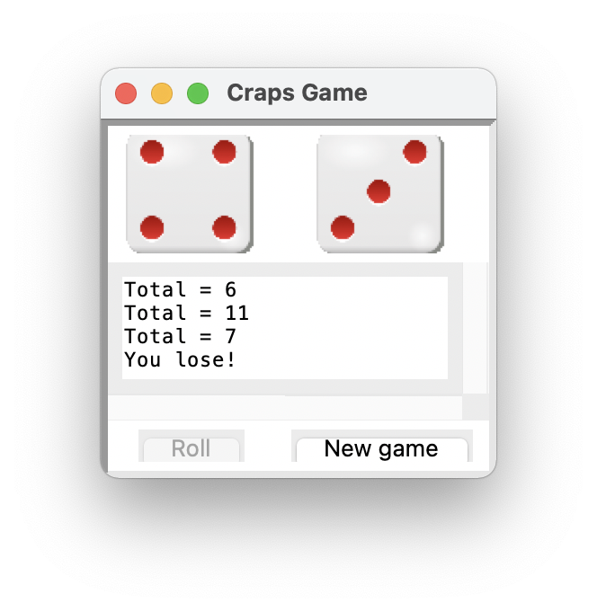

<!-- manual -->

## Your Tasks

Convert the DiceDemo program discussed in this chapter to a completed craps game gui application (**crapsgui.py**), using the `Player` data model class you developed in _Programming Exercise 6_ (**craps.py**).

> Output of rolls per game will vary.

A screen shot of a possible window is shown in Figure 10-7.

    

 Figure 10-7 A GUI-based craps game

> Be sure to use the field names provided in the comments in your starter code.

<!--
{
    "CopyExercise": {
        "name": "craps.py",
        "copyTarget": "/chapter10/ex06/student/craps.py",
        "pasteTarget": "/craps.py"
    }
}
-->

## Instructions
