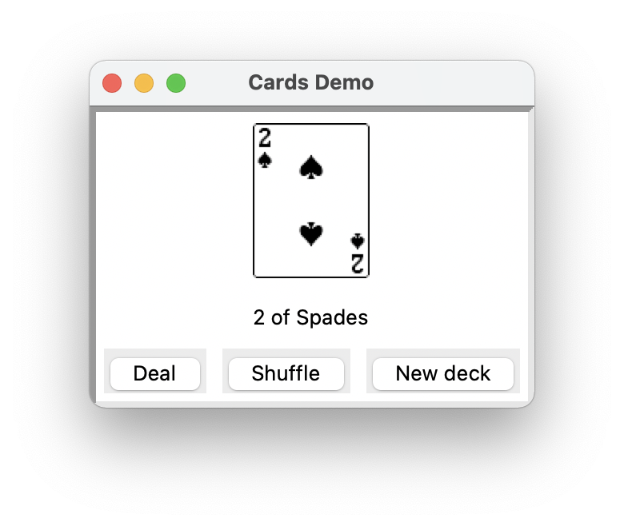
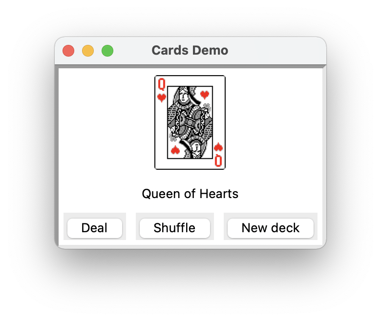

<!-- manual -->

## Your Tasks

Computer card games are more fun if you can see the images of the cards in a window, as shown in the screen shot in Figure 10-8.

    
    

 Figure 10-9 A GUI-based craps game

Assume that the 52 images for a deck of cards are in a _DECK_ folder, with the file naming scheme `<rank number><suit letter>.gif`. Thus, for example, the image for the Ace of Hearts is in a file named _1h.gif_, and the image for the King of Spades is in a file named _13s.gif_. Furthermore, there is an image file named _b.gif_ for the backside image of all the cards.

This will be the card’s image if its `faceup` variable is `False`. Using the `DiceDemo` program as a role model, write a GUI program (in the files **cardsgui.py** and **cards.py**) that allows you to deal and view cards from a deck. Be sure to define a helper method that takes a `Card` object as an argument and returns its associated image, and remember to turn the cards as you deal them. (LO: 10.1, 10.2)

<!--
{
    "CopyExercise": {
        "name": "cards.py",
        "copyTarget": "/chapter10/ex08/student/cards.py",
        "pasteTarget": "/cards.py"
    }
}
-->

## Instructions
