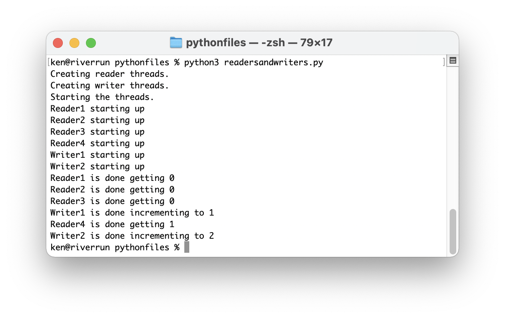

<!-- manual -->

## Your Tasks

Write the tester program (in the file **readersandwriters.py**) for readers and writers of a shared `Counter` object. A sample run is shown in Figure 12-4. (LO: 12.1, 12.2)

    

 Figure 12-4

## Instructions
