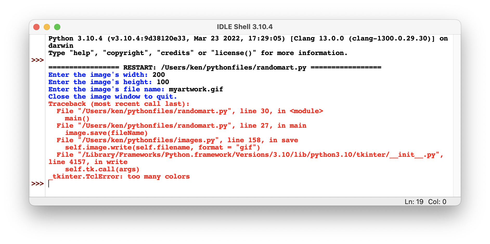
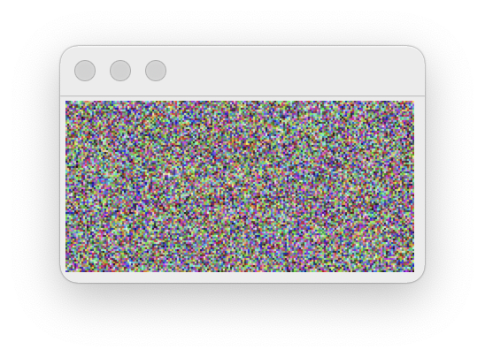

<!--manual-->

## Your Tasks

Jill is developing an image processing program that creates artworks with random colors. The inputs to the program are the width and height of a new image, and the name of a file to which the image should be saved. Here is the code for Jill’s program:

```python
from images import Image
import random

def main():
    """Generates and saves images with random colors.
    Inputs: The image's width, height,
    and output file name."""
    width = int(input("Enter the image's width: "))
    height = int(input("Enter the image's height: "))
    fileName = input("Enter the image's file name: ")

    # Create a table of 256 unique colors for GIF image
    colors = []
    while len(colors) < 255:
        r = random.randint(0, 255)
        g = random.randint(0, 255)
        b =random.randint(0, 255)
        if not (r, g, b) in colors:
            colors.append((r, g, b))

    image = Image(width, height)
    for y in range(image.getHeight()):
        for x in range(image.getWidth()):
            color = random.choice(colors)
            image.setPixel(x, y, color)

    print("Close the image window to quit. ")
    image.draw()
    image.save(fileName)

if __name__ == "__main__":
    main()

```

When Jill runs the program, she enters her inputs and views the image before it’s saved. But when she closes the window and the program attempts to save the image, Python raises an error that the image has too many colors, as shown in **Figure 8-18**.

<p align="center">
    
    
</p>

<sup>_Figure 8-18_</sup>

Determine why this error occurs and correct it. Jack reminds Jill that the GIF format supports at most 256 unique colors.

## Instructions
