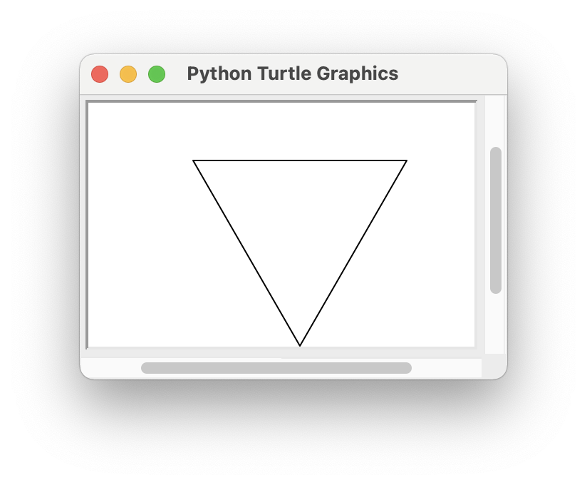
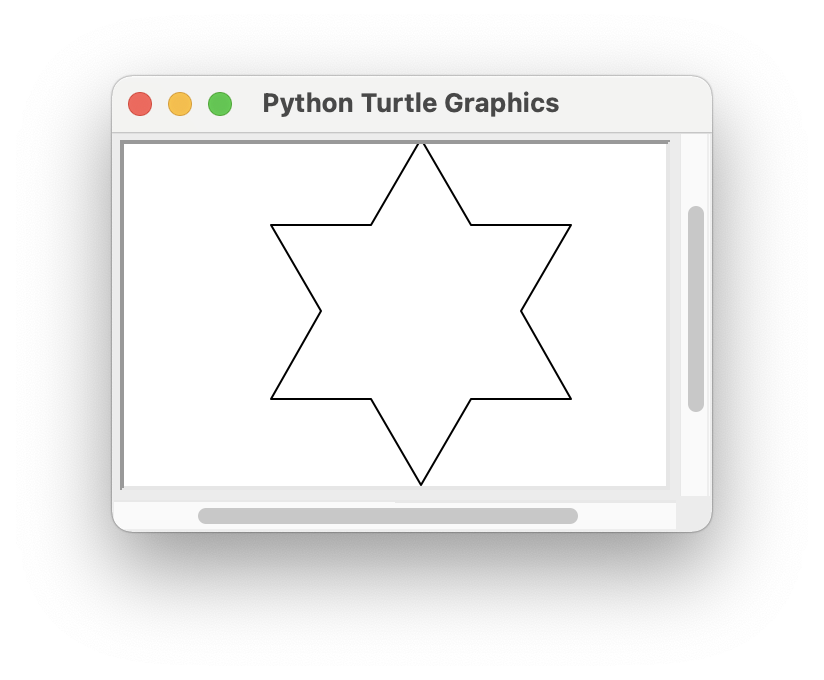
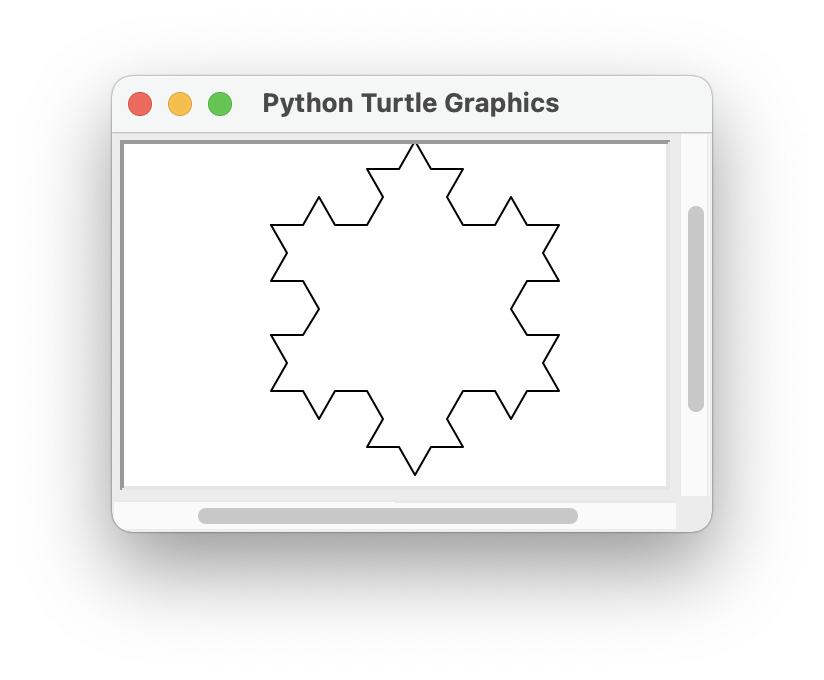

<!-- manual -->

## Your Tasks

The Koch snowflake is a fractal shape. At level 0, the shape is an equilateral triangle. At level 1, each line segment is split into four equal parts, producing an equilateral bump in the middle of each segment. _Figure 8-15_ shows these shapes at levels 0, 1, and 2. (LO: 8.1)

    
    
    

 _Figure 8-15_

At the top level, the script uses a function `drawFractalLine` to draw three fractal lines. Each line is specified by a given distance, direction (angle), and level. The initial angles are 0, –120, and 120 degrees. The initial distance can be any size, such as 200 pixels. The function `drawFractalLine` is recursive. If the level is 0, then the turtle moves the given distance in the given direction. Otherwise, the function draws four fractal lines with one-third of the given distance, angles that produce the given effect, and the given level minus 1. Write a script (in the file **koch.py**) that draws the Koch snowflake.

## Instructions
