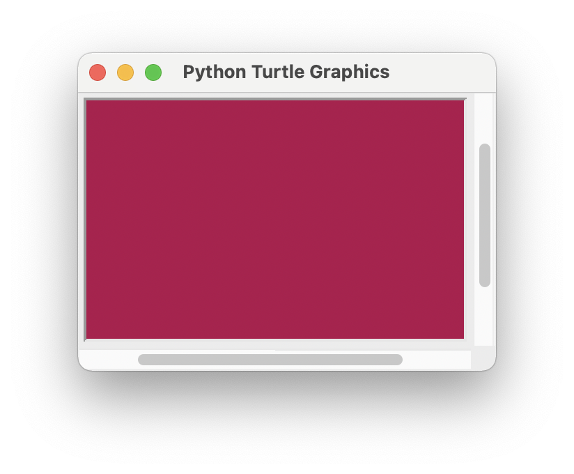
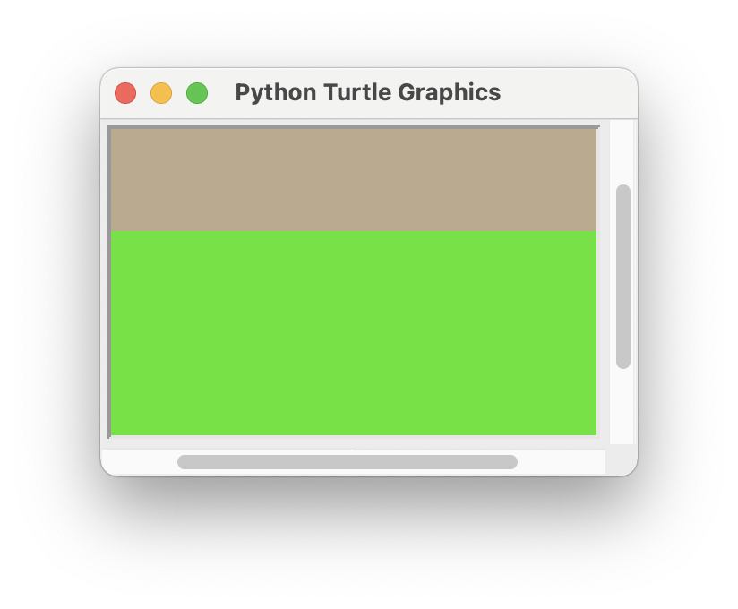
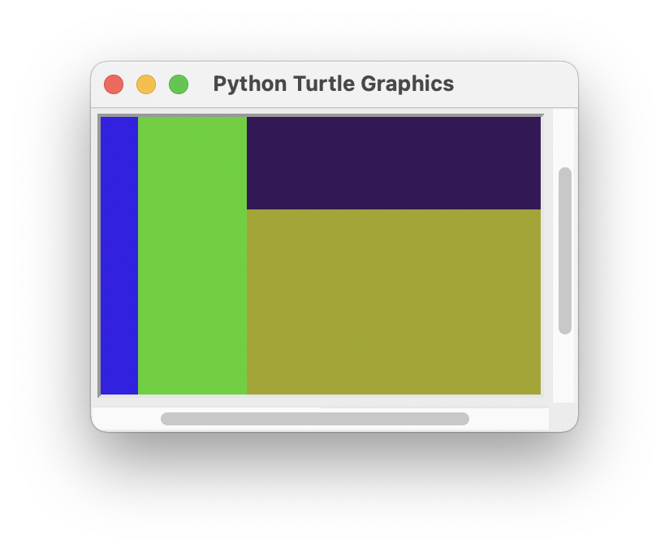

<!-- manual -->

## Your Tasks

The twentieth-century Dutch artist Piet Mondrian developed a style of abstract painting that exhibited simple recursive patterns. To generate such a pattern with a computer, one would begin with a filled rectangle in a random color and then repeatedly fill two unequal subdivisions with random colors, as shown in _Figure 8-16_. (LO: 8.1)

    
    
    

_Figure 8-16_

As you can see, the algorithm continues the process of subdivision until an “aesthetically right moment” is reached. In this version, the algorithm divides the current rectangle into portions representing one-third and two-thirds of its area and alternates these subdivisions along the horizontal and vertical axes. Design, implement, and test a script (in the file **mondrian.py**) that uses a recursive function to draw these patterns

## Instructions
