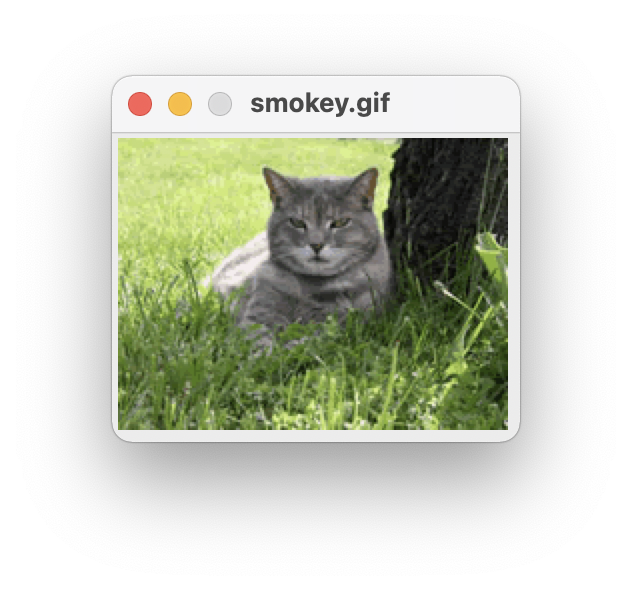
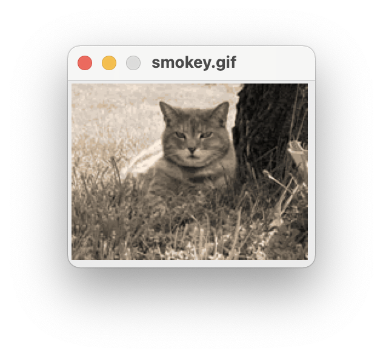

<!-- manual -->

## Your Tasks

Old-fashioned photographs from the nineteenth century are not quite black and white and not quite color, but seem to have shades of gray, brown, and blue. This effect is known as **sepia**, as shown in _Figure 8-17_. (LO: 8.2)

<p align="center">
    
    
</p>

<sup>_Figure 8-17_</sup>

Write and test a function named `sepia` (in the file **sepia.py**) that converts a color image to sepia. This function should first call `grayscale` to convert the color image to grayscale. A code segment for transforming the grayscale values to achieve a sepia effect follows. Note that the value for green does not change.

```python
(red, green, blue) = image.getPixel(x, y)
if red < 63:
    red = int(red * 1.1)
    blue = int(blue * 0.9)
elif red < 192:
    red = int(red * 1.15)
    blue = int(blue * 0.85)
else:
    red = min(int(red * 1.08), 255)
    blue = int(blue * 0.93)
```

## Instructions
