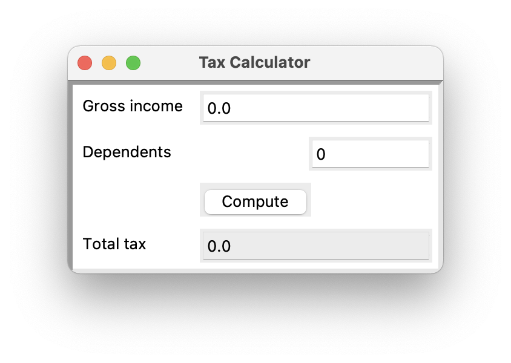
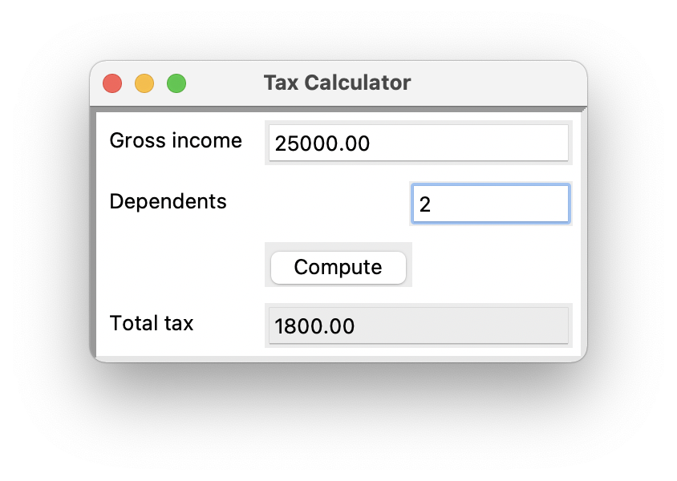

<!-- manual -->

## Your Tasks

Write a GUI-based program in the file **taxformwithgui.py** that implements the tax calculator program shown in _Figure 9-2_. (LO: 9.2, 9.3, 9.4, 9.5)

    
    

 _Figure 9-2_

## Instructions
